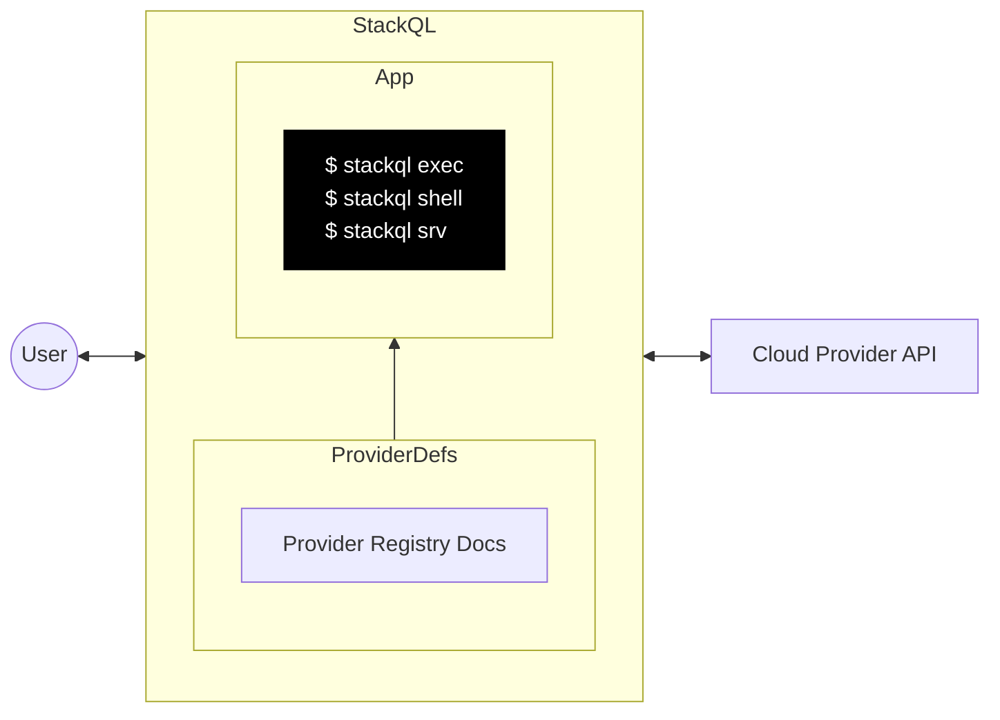

<!-- web assets -->
[logo]: https://stackql.io/img/stackql-logo-bold.png "stackql logo"
[homepage]: https://stackql.io/
[docs]: https://stackql.io/docs
[blog]: https://stackql.io/blog
[registry]: https://github.com/stackql/stackql-provider-registry
[variables]: https://stackql.io/docs/getting-started/variables
[macpkg]: https://storage.googleapis.com/stackql-public-releases/latest/stackql_darwin_multiarch.pkg
[winmsi]: https://releases.stackql.io/stackql/latest/stackql_windows_amd64.msi
[winzip]: https://releases.stackql.io/stackql/latest/stackql_windows_amd64.zip
[tuxzip]: https://releases.stackql.io/stackql/latest/stackql_linux_amd64.zip
<!-- docker links -->
[dockerhub]: https://hub.docker.com/u/stackql
[dockerstackql]: https://hub.docker.com/r/stackql/stackql
[dockerjupyter]: https://hub.docker.com/r/stackql/stackql-jupyter-demo
<!-- github actions links -->
[setupaction]: https://github.com/marketplace/actions/stackql-studios-setup-stackql
[execaction]: https://github.com/marketplace/actions/stackql-studios-stackql-exec
<!-- badges -->
[badge1]: https://img.shields.io/badge/platform-windows%20macos%20linux-brightgreen "Platforms"
[badge2]: https://github.com/stackql/stackql/workflows/Go/badge.svg "Go"
[badge3]: https://img.shields.io/github/license/stackql/stackql "License"
[badge4]: https://img.shields.io/tokei/lines/github/stackql/stackql "Lines"    
<!-- github links -->
[issues]: https://github.com/stackql/stackql/issues/new?assignees=&labels=bug&template=bug_report.md&title=%5BBUG%5D
[features]: https://github.com/stackql/stackql/issues/new?assignees=&labels=enhancement&template=feature_request.md&title=%5BFEATURE%5D
[developers]: /docs/developer_guide.md
[registrycont]: /docs/registry_contribution.md
[designdocs]: /docs/high-level-design.md
[contributing]: /CONTRIBUTING.md
[discussions]: https://github.com/orgs/stackql/discussions
<!-- repo assets -->
[darkmodeterm]: /docs/images/stackql-light-term.gif#gh-dark-mode-only
[lightmodeterm]: /docs/images/stackql-dark-term.gif#gh-light-mode-only
<!-- misc links -->
[twitter]: https://twitter.com/stackql

<!-- language: lang-none -->
<div align="center">

[![logo]][homepage]  
![badge1]
![badge2]
![badge3]
![badge4]

</div>

<div align="center">


</div>
<div align="center">

### Deploy, manage and query cloud resources and interact with APIs using SQL
<!-- <h3 align="center">SQL based XOps, observability and middleware framework</h3> -->

<p align="center">

[__Read the docs »__][docs]  
[Raise an Issue][issues] · 
[Request a Feature][features] · 
[Developer Guide][developers] · 
[BYO Providers][registrycont]

</p>
</div>

<details open="open">
<summary>Contents</summary>
<ol>
<li><a href="#about-the-project">About The Project</a></li>
<li><a href="#installation">Installation</a></li>
<li><a href="#usage">Usage</a></li>
<!-- <li><a href="#roadmap">Roadmap</a></li> -->
<li><a href="#contributing">Contributing</a></li>
<li><a href="#license">License</a></li>
<li><a href="#contact">Contact</a></li>
<li><a href="#acknowledgements">Acknowledgements</a></li>
</ol>
</details>

## About The Project

[__StackQL__][homepage] is an open-source project built with Golang that allows you to create, modify and query the state of services and resources across different cloud and SaaS providers (Google, AWS, Azure, Okta, GitHub, etc.) using SQL semantics
<br />
<br />

![stackql-shell][darkmodeterm]
![stackql-shell][lightmodeterm]

### How it works

StackQL is a standalone application that can be used in client mode (via __`exec`__ or __`shell`__) or accessed via a Postgres wire protocol client (`psycopg2`, etc.) using server mode (__`srv`__).  

StackQL parses SQL statements and transpiles them into API requests to the cloud provider.  The API calls are then executed and the results are returned to the user.  

StackQL provider definitions are defined in OpenAPI extensions to the providers specification.  These definitions are then used to generate the SQL schema and the API client.  The source for the provider definitions are stored in the [__StackQL Registry__][registry].  

<details>
<summary><b>StackQL Context Diagram</b></summary>
<br />
The following context diagram describes the StackQL architecture at a high level:  

<!--  -->



More detailed design documentation can be found in the [here][designdocs].

</details>

## Installation

StackQL is available for Windows, MacOS, Linux, Docker, GitHub Actions and more.  See the installation instructions below for your platform.  

<details>
<summary><b>Installing on MacOS</b></summary>

- Homebrew (`amd64` and `arm64`)
  - `brew install stackql` *or* `brew tap stackql/tap && brew install stackql/tap/stackql`
- MacOS PKG Installer (`amd64` and `arm64`)
  - download the latest [MacOS PKG installer for StackQL][macpkg]
  - run the installer and follow the prompts

</details>

<details>
<summary><b>Installing on Windows</b></summary>

- MSI Installer
  - download the latest [MSI installer for StackQL][winmsi]
  - run the installer and follow the prompts
- Chocolatey
  - install [Chocolatey](https://chocolatey.org/install)
  - run `choco install stackql`
- ZIP Archive
  - download the latest [Windows ZIP archive for StackQL][winzip]
  - extract the archive (code signed `stackql.exe` file) to a directory of your choice
  - add the directory to your `PATH` environment variable (optional)

</details>

<details>
<summary><b>Installing on Linux</b></summary>

- ZIP Archive
  - download the latest [Linux ZIP archive for StackQL][tuxzip]
    - or via `curl -L https://bit.ly/stackql-zip -O && unzip stackql-zip`
  - extract the archive (`stackql` file) to a directory of your choice
  - add the directory to your `PATH` environment variable (optional)

</details>

<details>
<summary><b>Getting StackQL from DockerHub</b></summary>

> View all available StackQL images on [__DockerHub__][dockerhub].  Images available include [__`stackql`__][dockerstackql], [__`stackql-jupyter-demo`__][dockerjupyter] and more.  Pull the latest StackQL base image using:  

```bash
docker pull stackql/stackql
```

</details>

<details>
<summary><b>Using StackQL with GitHub Actions</b></summary>

> Use StackQL in your GitHub Actions workflows to automate cloud infrastructure provisioning, IaC assurance, or compliance/security.  Available GitHub Actions include: [`setup-stackql`][setupaction], [`stackql-exec`][execaction] and more

</details>

## Usage

StackQL can be used via the interactive REPL shell, or via the `exec` command or ran as a server using the [Postgres wire protocol](https://www.postgresql.org/docs/current/protocol.html).  

> ℹ️ StackQL does not require or install a database.

* Interactive Shell
  ```sh
  # run interactive stackql queries
  stackql shell --auth="${AUTH}"
  ```
* Execute a statement or file
  ```sh
  stackql exec --auth="${AUTH}" -i myscript.iql --iqldata vars.jsonnet --output json
  
  # or
  
  stackql exec --auth="${AUTH}" "SELECT id, status FROM aws.ec2.instances WHERE region = 'us-east-1'"
  ```

  > ℹ️ output options of `json`, `csv`, `table` and `text` are available for the `exec` command using the `--output` flag

  > ℹ️ StackQL supports passing parameters using `jsonnet` or `json`, see [__Using Variables__][variables]
* Server
  ```sh
  # serve client requests over the Postgres wire protocol (psycopg2, etc.) 
  stackql srv --auth="${AUTH}"
  ```

_For more examples, please check our [Blog][blog]_

<!-- ## Roadmap

See our [__roadmap__](https://github.com/othneildrew/Best-README-Template/issues) to see where we are going with the project. -->

## Contributing

Contributions are welcome and encouraged.  For more information on how to contribute, please see our [__contributing guide__][contributing].

## License

Distributed under the MIT License. See [`LICENSE`](https://github.com/stackql/stackql/blob/main/LICENSE) for more information.  Licenses for third party software we are using are included in the [/docs/licenses](/docs/licenses) directory.

## Contact

Get in touch with us via Twitter at [__@stackql__][twitter], email us at [__info@stackql.io__](info@stackql.io) or start a conversation using [__discussions__][discussions].

## Acknowledgements
Forks of the following support our work:

* [vitess](https://vitess.io/)
* [kin-openapi](https://github.com/getkin/kin-openapi)
* [gorilla/mux](https://github.com/gorilla/mux)
* [readline](https://github.com/chzyer/readline)
* [psql-wire](https://github.com/jeroenrinzema/psql-wire)

We gratefully acknowledge these pieces of work.

